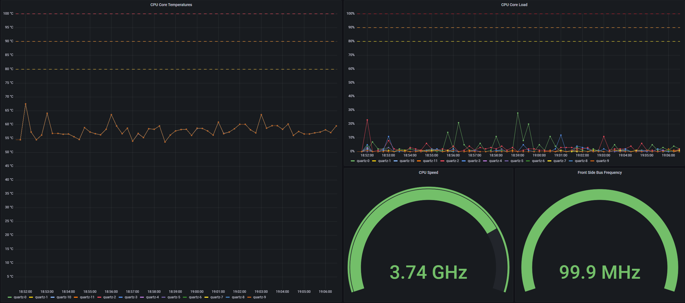

# coretemp-exporter

[](https://github.com/jeremyje/coretemp-exporter/actions/workflows/ci.yaml)

A Prometheus exporter that emits CPU health information such as core temperatures. There are also some example dashboards to visualize your computer's sensor data.

## Building

To build coretemp-exporter you need [Go](https://go.dev/dl/) and Make installed. You can use Linux or Windows hosts to build.

```bash
# (optional) Delete all build artifacts.
make clean

# Build all binaries.
make all -j$(nproc)

# Binaries are created in build/$GOOS-$GOARCH/ directory.
```

## Running

You can run `coretemp-exporter` on Windows or Linux. By default it'll serve its metrics at [`:8081`](http://localhost:8081).

### Linux

```bash
# Install lm-sensors
sudo apt-get install lm-sensors

# Test that lm-sensors is working.
sensors

# If it's not working try.
sudo sensors-detect

# Run coretemp-exporter.
./build/linux_amd64/coretemp-exporter
```

### Windows

1. Install and run [ALCPU CoreTemp](https://www.alcpu.com/CoreTemp/). It is important that this application is running otherwise you will not get any data.
1. Install [MSVC Runtime 10](https://learn.microsoft.com/en-US/cpp/windows/latest-supported-vc-redist).
1. Run the commands below.

```powershell
# Run in the console.
.\build\windows_amd64\coretemp-exporter.exe

###################
# Windows Service #
###################

# Register Service
.\build\windows_amd64\coretemp-exporter.exe -svc=install
# Start Service
.\build\windows_amd64\coretemp-exporter.exe -svc=start
# Stop Service
.\build\windows_amd64\coretemp-exporter.exe -svc=stop
# Uninstall Service
.\build\windows_amd64\coretemp-exporter.exe -svc=remove
```

## Dashboards

You'll need [Docker](https://docs.docker.com/get-docker/) and [docker-compose](https://github.com/docker/compose/releases) installed. Windows users should run Docker in Linux mode.

```bash
# Go to the docker-compose directory.
cd install/compose
# Launch Prometheus and Grafana. 
docker-compose up -d
```

Once both services are you you can view the graphs via: [`:3000/dashboards`](http://localhost:3000/dashboards). To login use the following credentials:

* Username: `root`
* Password: `admin`

Once you've logged in you can visit the `CPU` page and you should see something like:


